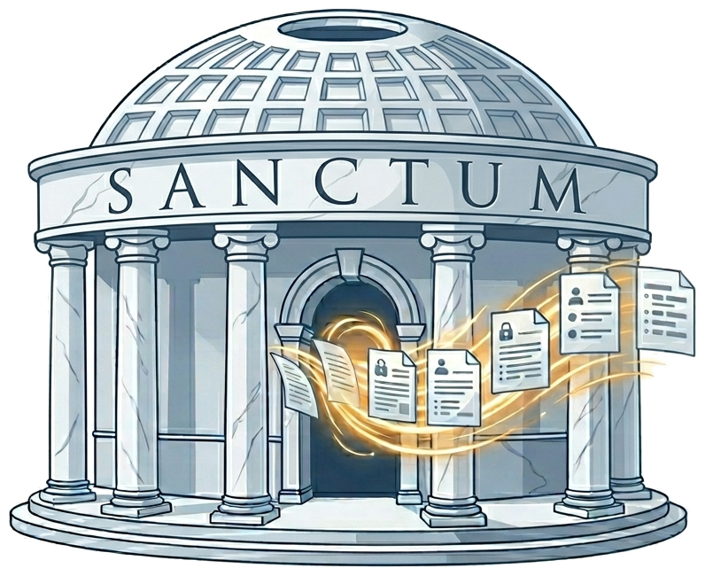

<div align="center">

<br/>


# Sanctum Desktop



### _The downloadable desktop app for Sanctum — local-first document anonymization._

**Drag in a document. Review the detections. Export a clean copy. All on your machine.**

Sanctum Desktop is the end-user GUI for [Sanctum](https://github.com/FilippoTonci/sanctum) — a local-first, air-gapped PII anonymization engine for legal and consulting professionals. This repository ships the Electron shell: a signed, installable desktop app that spawns the Sanctum Python backend as a loopback-only sidecar and drives it through a keyboard-first review workflow.

[Getting Started](#-getting-started) · [How It Works](#-how-it-works) · [Architecture](#-architecture) · [Roadmap](#-roadmap) · [Contributing](#-contributing)

---

</div>

## 📌 Why a Separate Repo

The Sanctum project is split into two repositories by design:

| Repo                                                                               | What it ships                                               | Toolchain                          |
| ---------------------------------------------------------------------------------- | ----------------------------------------------------------- | ---------------------------------- |
| [`sanctum`](https://github.com/FilippoTonci/sanctum)                               | The anonymization engine, CLI, HTTP API, document adapters  | Python, pytest, mypy, ruff         |
| [`sanctum-desktop`](https://github.com/FilippoTonci/sanctum-desktop) _(this repo)_ | The Electron desktop app — the thing users actually install | Node, TypeScript, Vite, Playwright |

Three reasons for the split:

1. **Toolchains diverge.** Mixing Python and Node CI matrices, dependency resolvers, and editor configs costs more than it saves.
2. **Release cadence diverges.** The Python backend ships as a packaged sidecar; the Electron shell ships as signed platform installers through an auto-update channel.
3. **Security boundary.** Keeping the renderer — the only part of Sanctum that renders arbitrary user DOCX — in a separate repo forces the backend to treat it as an untrusted client. The Flask API's bearer-token + Host/Origin guards already do this; a single-repo layout tempts shortcuts.

The two repos communicate through exactly one contract: the OpenAPI spec published by `sanctum`. Everything else is internal.

---

## ✨ What This App Does

### 🖱️ Drag-and-Drop Review

- **Drop a `.docx`** onto the window and the app spawns the Sanctum engine, analyses the file, and opens a review surface in seconds.
- **Inline highlights** — every detected PII span is painted directly over the rendered document using the CSS Custom Highlight API. No modal dialogs, no separate "findings" tab.
- **Keyboard-first navigation** — step through detections with `↓` / `↑` (or `Tab` / `Shift+Tab`), `Enter` to accept, `Delete` / `Backspace` to reject — both auto-advance to the next pending detection so a long document reviews in one continuous flow. `e` edits the replacement, `m` marks a missed span. Designed for professionals who review hundreds of detections per document.

### 🔒 Air-Gapped by Construction

- **Loopback-only backend.** The Electron main process spawns the Python sidecar on `127.0.0.1`, generates a random bearer token, and pipes it over stdin. The token never touches disk, never appears in `ps auxf`.
- **Zero network calls at runtime.** `HF_HUB_OFFLINE=1` and `TRANSFORMERS_OFFLINE=1` are set in the sidecar's environment so a missing model fails fast instead of silently downloading.
- **`webRequest` filter** blocks any network destination other than `127.0.0.1` — a belt for the airgap suspenders.
- **Signed installers only.** No unsigned `.dmg` / `.msi` / `.AppImage` ever ships to users, even in pre-release channels.

### 📄 Fidelity-Preserving Renderer

- Renders `.docx` files with [docx-preview](https://github.com/VolodymyrBaydalka/docxjs) — tables, images, headers, footers, lists, and tracked changes all render without reprocessing the file.
- **The renderer is paint-only.** It never mutates the document. It captures decisions; the backend writes the output.
- **Single document model.** The backend's per-run `TextSegment` offsets are the source of truth; the renderer's DOM is just a projection.

### 🧠 Powered by the Sanctum Engine

- Dual-tier NER: **Standard** (spaCy `en_core_web_sm`, ~15 MB bundled) or **Professional** (GLiNER-medium v2.1, +0.17 macro-F1, fetched on-demand from a Sanctum-owned CDN with explicit user consent).
- Five anonymization operators — `hips` (synthetic replacement), `replace`, `redact`, `mask`, `encrypt`, `pseudonymize` — selectable per detection.
- Encrypted mapping store (ChaCha20-Poly1305 + Argon2id) for reversible pseudonymization, unlocked from the app's title bar.

---

## 🏗️ Architecture

```
┌─────────────────────────────────────────────────────────────────┐
│                Sanctum Desktop (this repo)                      │
│            Electron + Vite + React 19 + TypeScript              │
│  ┌───────────────────────────────────────────────────────────┐  │
│  │ Renderer  (sandboxed, contextIsolation=true)              │  │
│  │   docx-preview  +  CSS Custom Highlight API overlay       │  │
│  │   Detection tooltip  +  sidebar  +  keyboard map          │  │
│  └────────────────────────┬──────────────────────────────────┘  │
│                           │ preload: window.sanctum             │
│  ┌────────────────────────▼──────────────────────────────────┐  │
│  │ Main process                                              │  │
│  │   sidecar.ts   spawn + health-poll + SIGTERM on quit      │  │
│  │   models.ts    one-shot model download (user-confirmed)   │  │
│  │   settings.ts  persist settings → sidecar env on respawn  │  │
│  └────────────────────────┬──────────────────────────────────┘  │
└───────────────────────────│─────────────────────────────────────┘
                            │  HTTP on 127.0.0.1 only
                            │  bearer token via stdin
┌───────────────────────────▼─────────────────────────────────────┐
│          Sanctum Python sidecar (from `sanctum` repo)           │
│    Flask API → Analyzer → Anonymizer → Document writers         │
│    GET /health   POST /review-sessions   POST .../commit        │
└─────────────────────────────────────────────────────────────────┘
```

### Sidecar lifecycle

1. **Spawn.** Main picks a free port via `net.createServer().listen(0)`, generates a 32-byte token, spawns `sanctum-sidecar --port <n> --token-stdin`.
2. **Handshake.** Main reads a single machine-readable line from the sidecar's stdout: `SANCTUM_READY host=127.0.0.1 port=<N> token_path=<…>`.
3. **Health poll.** Main hits `GET /health` with the bearer token until 200 OK — models may still be loading after HTTP is up. A splash screen covers the wait.
4. **Expose.** `contextBridge.exposeInMainWorld('sanctum', { baseUrl, token })`. The renderer builds its own `fetch` calls from there.
5. **Shutdown.** `app.on('before-quit')` sends SIGTERM to the sidecar and waits up to 5 s before SIGKILL.

### Renderer → Backend contract

The renderer is generated from `schema/openapi.json` in the `sanctum` repo (pinned to a specific commit per release). The pin is atomic: a desktop installer always ships the sidecar built from the same commit it was tested against. `/health` returns both `sanctum_commit` and `openapi_digest`, which the app verifies at startup — any mismatch means the installer is corrupt or the sidecar was swapped manually, and the app fails fast with an actionable error.

---

## 🚀 Getting Started

> **Status:** Workstreams 1–5 of Phase 3 are shipped — backend contract hardening (`sanctum`), Electron scaffold, sidecar integration, the `.docx` review surface, and the full session workflow UI (landing page, real session create/commit/abandon with sync, mapping-store unlock, settings + sidecar respawn, typed error surfaces, and resume from a Recent Sessions row). A packaged unsigned build runs end-to-end on Linux. WS6 (signing, notarization, release pipeline) is the next major milestone — no signed installers yet.

### Prerequisites

- Node 20 LTS or newer
- A local checkout of [`sanctum`](https://github.com/FilippoTonci/sanctum) with `pip install -e .` for dev-mode sidecar spawning (see below)
- Python 3.10+ (for the sidecar)

### Developer install

```bash
git clone https://github.com/FilippoTonci/sanctum-desktop.git
cd sanctum-desktop
npm install
```

### Dev mode

In dev mode the Electron main process spawns the sidecar from a sibling `../sanctum` checkout instead of the packaged binary. This unblocks backend iteration without rebuilding PyInstaller output on every change.

```bash
# .env.local
ELECTRON_DEV=1
SANCTUM_DEV_REPO=../sanctum
```

```bash
npm run dev        # launches Electron with the Vite renderer in HMR mode
npm run typecheck  # tsc --noEmit
npm run lint       # eslint + prettier
npm run test       # Vitest unit tests
npm run test:e2e   # Playwright end-to-end tests against a dev build
```

### Production build (unsigned, for local sanity checks)

```bash
npm run build      # electron-vite build
npm run make       # electron-builder — produces installers under dist/
```

Signed release builds run only from the tag-driven release workflow on the self-hosted Windows runner and GitHub-hosted macOS/Linux runners. See `RELEASE.md` (coming with WS6).

---

## ⌨️ Keyboard Reference

| Key                    | Action                                       |
| ---------------------- | -------------------------------------------- |
| `↓` / `Tab`            | Step to next detection                       |
| `↑` / `Shift + Tab`    | Step to previous detection                   |
| `Enter`                | Accept the focused detection (auto-advances) |
| `Delete` / `Backspace` | Reject the focused detection (auto-advances) |
| `e`                    | Edit the replacement text                    |
| `m`                    | Mark selected text as missed PII             |
| `Ctrl/Cmd + Z`         | Undo the last decision                       |
| `Esc`                  | Close tooltip / clear focus                  |
| `Ctrl/Cmd + Enter`     | Open the commit panel                        |

After Accept or Reject, focus jumps to the next still-pending detection — keep your hands on the home row and a long document reviews in one continuous flow. All shortcuts are suspended while an input is focused. `Tab` / `Shift+Tab` only step through detections when no other element holds focus, so native focus traversal in the sidebar / modals keeps working.

Clicking a detection in the document focuses it too — on the highlighted text or on its inline replacement preview — and the matching sidebar row scrolls into view. Clicking blank space leaves focus where it is; `Esc` is the way to clear it.

---

## 🗺️ Roadmap

This roadmap mirrors Phase 3 of the Sanctum project plan (`plans/phase-3-desktop-ui.md` in the `sanctum` repo).

### WS1 — Backend contract hardening ✅ _(shipped in `sanctum`)_

- [x] `/health` returns `sanctum_commit` + `openapi_digest`
- [x] `schema/openapi.json` generated and committed; CI diff gate
- [x] `sanctum serve --port 0` with `SANCTUM_READY` stdout signal
- [x] `sanctum serve --token-stdin` for out-of-process-list token delivery
- [x] SIGTERM cleanup audit with integration tests
- [x] Contract compat harness in CI

### WS2 — Desktop scaffold ✅ _(shipped)_

- [x] Electron + Vite + React 19 + TypeScript scaffold via `electron-vite`
- [x] Sandbox + contextIsolation + no node integration
- [x] ESLint, Prettier, `tsc --noEmit`, pre-commit (husky + lint-staged)
- [x] GitHub Actions CI matrix (macOS / Windows / Ubuntu)
- [x] Playwright smoke test
- [x] Code-signing secret placeholders

### WS3 — Python sidecar integration ✅ _(shipped)_

- [x] PyInstaller onedir build of the Sanctum backend
- [x] `spawnSidecar()` / `killSidecar()` lifecycle manager
- [x] Health polling + splash screen (cold start can exceed 30 s)
- [x] `contextBridge` exposure of `{ baseUrl, token }`
- [x] User-confirmed Professional-tier model download (1.4 GB)
- [x] Graceful-shutdown hooks

### WS4 — `.docx` review surface ✅ _(shipped)_

- [x] docx-preview integration with a `data-segment-id` emission patch (`patch-package`)
- [x] Segment-id ⇄ DOM Range mapping
- [x] CSS Custom Highlight API overlay (pending / accepted / rejected / focused)
- [x] Detection tooltip + sidebar list
- [x] Full keyboard navigation
- [x] Mark-missed-span flow
- [x] Per-detection operator picker
- [x] Commit flow with attestation checkbox

### WS5 — Session workflow UI ✅ _(shipped)_

- [x] Landing page, drop zone, recent sessions
- [x] Real `/review-sessions` create + commit + abandon (with optimistic+rollback decision sync)
- [x] Ghost-text preview overlay
- [x] Mapping-store unlock UX
- [x] Settings page → sidecar env on respawn
- [x] Error surfaces (409 / 413 / 415 / 503)
- [x] Session abandonment keeps the manifest so terminal sessions stay in Recent Sessions
- [x] Session resume from a Recent Sessions row (`GET /review-sessions/{id}/input` returns pinned bytes for OPEN sessions; terminal rows render disabled)
- [x] Accept/Reject UX redesign — sidebar-driven controls, no floating tooltip (issue #23)
- [x] Inline substitution on accept — replacement substitutes the original in document flow; sidebar always shows the proposed change (issue #27)

### WS6 — Polish, signing, release

- [ ] i18n (English + French, human-translated)
- [ ] Accessibility audit (WCAG AA, screen-reader labels, focus management)
- [ ] Diagnostic bundle export (no automated upload)
- [ ] macOS signing + notarization (Apple Developer ID)
- [ ] Windows signing (Azure Trusted Signing or Sectigo/DigiCert EV + YubiKey)
- [ ] Linux AppImage + deb with GPG signatures
- [ ] Split auto-update channels (shell vs. models)
- [ ] Tag-driven release workflow

### Phase 3.5 — Deferred formats _(post-MVP)_

- [ ] `.pdf` review surface (PDF.js + text-layer overlay)
- [ ] `.xlsx` review surface (SheetJS + custom cell grid)
- [ ] `.pptx` review surface (server-rendered slide PNGs + overlay)
- [ ] Batch processing and queues
- [ ] Opt-in local-only crash reporting

---

## 🧰 Tech Stack

| Layer             | Technology                                                                                                 |
| ----------------- | ---------------------------------------------------------------------------------------------------------- |
| Shell             | Electron (latest stable)                                                                                   |
| Build             | [`electron-vite`](https://electron-vite.org/) + `electron-builder`                                         |
| UI                | React 19 + TypeScript                                                                                      |
| State             | Zustand                                                                                                    |
| Renderer          | [`docx-preview`](https://github.com/VolodymyrBaydalka/docxjs) + CSS Custom Highlight API                   |
| Floating UI       | `@floating-ui/react`                                                                                       |
| Schema validation | Zod (generated from OpenAPI)                                                                               |
| i18n              | `react-i18next`                                                                                            |
| Unit tests        | Vitest                                                                                                     |
| E2E tests         | `@playwright/test` with Electron launch                                                                    |
| Linters           | ESLint (`@typescript-eslint`, `react-hooks`, `jsx-a11y`) + Prettier                                        |
| Backend           | Python sidecar (packaged from [`sanctum`](https://github.com/FilippoTonci/sanctum) via PyInstaller onedir) |

---

## 🔒 Security Posture

Before the first signed release ships, the following must be green:

- Electron fuses reviewed — Node integration off, sandbox on, ASAR integrity on, `contextIsolation` enforced.
- CSP on the renderer: `default-src 'self'; img-src 'self' data:; style-src 'self' 'unsafe-inline'` (the `unsafe-inline` allowance is for `docx-preview`'s inline styles; to be revisited in Phase 3.5).
- `shell.openExternal` is scheme-allowlisted.
- `webRequest` filter blocks every destination other than `127.0.0.1`.
- No telemetry or analytics at any point.
- The bearer token is never written to disk or appears in logs.
- The mapping-store passphrase lives in memory only for the duration of the unlock action, then cleared.

See [`sanctum/resources/presidio-architecture.md`](https://github.com/FilippoTonci/sanctum/blob/main/resources/presidio-architecture.md) for the engine-side network-call audit.

---

## 🤝 Contributing

Contributions welcome, especially around:

- `docx-preview` rendering edge cases (tables with merged cells, footnotes, embedded objects)
- Accessibility (keyboard-only flows, screen-reader labels)
- Localization (French first, then EU and Indic languages)
- Platform-specific packaging gotchas (Windows SmartScreen, macOS Gatekeeper, AppImage fuse3)

```bash
git checkout -b feature/your-feature
# Changes, tests, type-check, lint
git commit -m "feat: describe your change"
git push origin feature/your-feature
# Open a Pull Request
```

See `CONTRIBUTING.md` (coming with WS2) for the full ground rules.

---

## 📄 License

Sanctum Desktop is released under the [MIT License](LICENSE).

The Sanctum backend is licensed separately under MIT; see [`sanctum/LICENSE`](https://github.com/FilippoTonci/sanctum/blob/main/LICENSE). Microsoft Presidio is licensed under the MIT License.

---

## 🔗 Related

- [Sanctum — the engine](https://github.com/FilippoTonci/sanctum) — Python backend, CLI, HTTP API, document adapters
- [Phase 3 implementation plan](https://github.com/FilippoTonci/sanctum/blob/main/plans/phase-3-desktop-ui.md) — full Workstream-by-Workstream plan for this repo and the contract hardening it depends on
- [Microsoft Presidio](https://microsoft.github.io/presidio/) — the PII detection engine Sanctum wraps
- [Electron security checklist](https://www.electronjs.org/docs/latest/tutorial/security) — the posture this repo holds itself to

---

<div align="center">

**Built for the professionals whose livelihoods depend on confidentiality.**

_Sanctum Desktop — Clean documents. Protected clients. One click._

</div>
