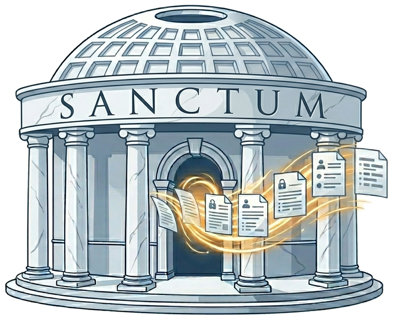

<div align="center">

<br/>


# Sanctum Desktop



### _The downloadable desktop app for Sanctum — local-first document anonymization._

**Drag in a document. Review the detections. Export a clean copy. All on your machine.**

Sanctum Desktop is the end-user GUI for [Sanctum](https://github.com/FilippoTonci/sanctum) — a local-first, air-gapped PII anonymization engine for legal and consulting professionals. This repository ships the Electron shell: an installable desktop app (signing lands in WS6) that spawns the Sanctum Python backend as a loopback-only sidecar and drives it through a keyboard-first review workflow.

[Getting Started](#-getting-started) · [How It Works](#-how-it-works) · [Architecture](#-architecture) · [Roadmap](#-roadmap) · [Contributing](#-contributing)

---

</div>

## 📌 Why a Separate Repo

The Sanctum project is split into two repositories by design:

| Repo                                                                               | What it ships                                               | Toolchain                          |
| ---------------------------------------------------------------------------------- | ----------------------------------------------------------- | ---------------------------------- |
| [`sanctum`](https://github.com/FilippoTonci/sanctum)                               | The anonymization engine, CLI, HTTP API, document adapters  | Python, pytest, mypy, ruff         |
| [`sanctum-desktop`](https://github.com/FilippoTonci/sanctum-desktop) _(this repo)_ | The Electron desktop app — the thing users actually install | Node, TypeScript, Vite, Playwright |

Three reasons for the split:

1. **Toolchains diverge.** Mixing Python and Node CI matrices, dependency resolvers, and editor configs costs more than it saves.
2. **Release cadence diverges.** The Python backend ships as a packaged sidecar; the Electron shell ships as signed platform installers through an auto-update channel.
3. **Security boundary.** Keeping the renderer — the only part of Sanctum that renders arbitrary user DOCX — in a separate repo forces the backend to treat it as an untrusted client. The Flask API's bearer-token + Host/Origin guards already do this; a single-repo layout tempts shortcuts.

The two repos communicate through exactly one contract: the OpenAPI spec published by `sanctum`. Everything else is internal.

---

## ✨ What This App Does

### 🖱️ Drag-and-Drop Review

- **Drop a `.docx`, `.pptx` or `.pdf`** onto the window (or use ⌘O) and the app spawns the Sanctum engine, analyses the file, and opens a review surface in seconds.
- **A three-pane studio.** A sidebar lists every finding (one row per finding — pieces of a linked finding share a row), the canvas shows the document with every detected span painted in place via the CSS Custom Highlight API, and an inspector on the right shows the focused finding, its verdict buttons and the bulk actions for its type. A narrow window collapses the sidebar to a rail; the findings list then opens as an overlay from the toolbar.
- **Keyboard-first navigation** — step through detections with `↓` / `↑` (or `Tab` / `Shift+Tab`), `Enter` to accept, `Delete` / `Backspace` to reject — both auto-advance to the next pending detection so a long document reviews in one continuous flow. `Shift+A` / `Shift+R` redact or keep every pending finding of the focused type. `e` edits the replacement, `m` marks a missed span. `⌘K` opens a command palette for everything else.
- **Save check.** After writing the copy the engine re-reads it. If a value you redacted still appears elsewhere it refuses the save (HTTP 422) and the app shows a sheet listing each leaked value and where it sits, with "Redact these too" to add them and retry. Places you chose to keep are flagged, and values the app can't reach (a footnote, text box or chart) are called out so you can fix the original.

### 🔒 Air-Gapped by Construction

- **Loopback-only backend.** The Electron main process spawns the Python sidecar on `127.0.0.1`, generates a random bearer token, and pipes it over stdin. The token never touches disk, never appears in `ps auxf`.
- **Zero network calls at runtime.** `HF_HUB_OFFLINE=1` and `TRANSFORMERS_OFFLINE=1` are set in the sidecar's environment so a missing model fails fast instead of silently downloading.
- **`webRequest` filter** blocks any network destination other than `127.0.0.1` — a belt for the airgap suspenders.
- **Signed installers before any release.** Signing and notarization are WS6 work and not done yet; the builds you can make today are unsigned, local-only, and explicitly not distributable.

### 📄 Fidelity-Preserving Renderer

- **Word:** rendered with [docx-preview](https://github.com/VolodymyrBaydalka/docxjs) — tables, images, headers, footers, lists, and tracked changes render without reprocessing the file.
- **PowerPoint:** `PptxView` draws the engine's `/layout` as positioned slides, findings grouped by slide. Only inline raster images (`data:image/…`) are drawn.
- **PDF:** `PdfView` paints each page with PDF.js (`pdfjs-dist`, bundled locally — no CDN) under a transparent text layer from `/layout`, with zoom (Fit / 100% / 150%) and page thumbnails.
- **The renderer is paint-only.** It never mutates the document. It captures decisions; the backend writes the output.
- **Single document model.** The backend's per-run `TextSegment` offsets are the source of truth; the renderer's DOM is just a projection.

### 🧠 Powered by the Sanctum Engine

- One bundled NER model: **GLiNER-PII** (`knowledgator/gliner-pii-base-v1.0`, Apache-2.0, ~200 MB ONNX, no PyTorch), plus Presidio's pattern recognizers and document-wide name propagation. It ships inside the app; nothing is downloaded.
- The app creates every session with the `replace` operator (entity-tag placeholders, editable per finding). The engine also supports `hips`, `redact`, `mask`, `encrypt` and `pseudonymize` and an encrypted mapping store; the studio UI does not expose them.

---

## 🏗️ Architecture

```
┌─────────────────────────────────────────────────────────────────┐
│                Sanctum Desktop (this repo)                      │
│            Electron + Vite + React 19 + TypeScript              │
│  ┌───────────────────────────────────────────────────────────┐  │
│  │ Renderer  (sandboxed, contextIsolation=true)              │  │
│  │   docx-preview / PptxView / PdfView + highlight overlay   │  │
│  │   Studio: sidebar, inspector, ⌘K palette, keyboard map    │  │
│  └────────────────────────┬──────────────────────────────────┘  │
│                           │ preload: window.sanctum             │
│  ┌────────────────────────▼──────────────────────────────────┐  │
│  │ Main process                                              │  │
│  │   sidecar.ts   spawn + health-poll + SIGTERM on quit      │  │
│  │   settings.ts  persist settings → sidecar env on respawn  │  │
│  │   menu.ts      native menu → renderer commands            │  │
│  └────────────────────────┬──────────────────────────────────┘  │
└───────────────────────────│─────────────────────────────────────┘
                            │  HTTP on 127.0.0.1 only
                            │  bearer token via stdin
┌───────────────────────────▼─────────────────────────────────────┐
│          Sanctum Python sidecar (from `sanctum` repo)           │
│    Flask API → Analyzer → Anonymizer → Document writers         │
│  /health  /review-sessions  .../layout  .../commit              │
└─────────────────────────────────────────────────────────────────┘
```

### Sidecar lifecycle

1. **Spawn.** Main generates a 32-byte token and spawns `sanctum-sidecar serve --port 0 --token-stdin` — the sidecar picks its own free port and reads the token from stdin.
2. **Handshake.** Main reads a single machine-readable line from the sidecar's stdout: `SANCTUM_READY host=127.0.0.1 port=<N> token_source=stdin`. `src/main/sidecar.ts` parses the host and port out of it.
3. **Health poll.** Main hits `GET /health` with the bearer token until 200 OK — models may still be loading after HTTP is up. A splash screen covers the wait.
4. **Expose.** `contextBridge.exposeInMainWorld('sanctum', { baseUrl, token })`. The renderer builds its own `fetch` calls from there.
5. **Shutdown.** `app.on('before-quit')` sends SIGTERM to the sidecar and waits up to 5 s before SIGKILL.

### Renderer → Backend contract

The renderer's wire types (`src/renderer/src/api/types.ts`) are hand-written today, mirroring `schema/openapi.json` in the `sanctum` repo (pinned to a specific commit per release). The pin is atomic: a desktop installer always ships the sidecar built from the same commit it was tested against. `/health` reports `sanctum_commit` and `openapi_digest`, and the main process surfaces both — but **nothing verifies them yet**. Failing fast on a mismatched or manually swapped sidecar is a WS6 item.

---

## 🚀 Getting Started

> **Status:** Workstreams 1–5 of Phase 3 are shipped — backend contract hardening (`sanctum`), Electron scaffold, sidecar integration, the `.docx` review surface, and the full session workflow UI — plus the studio redesign and `.pptx` / `.pdf` review (0.2.0-rc.1). Packaged unsigned builds run end-to-end on Linux and macOS (Apple Silicon). WS6 (signing, notarization, release pipeline) is the next major milestone — no signed installers yet.

### Prerequisites

- Node 20 LTS or newer
- A sibling checkout of [`sanctum`](https://github.com/FilippoTonci/sanctum) at `../sanctum`, with `pip install -e '.[security,api,documents]'` inside its `.venv` and the NER model fetched once with `python scripts/fetch_ner_model.py`, for dev-mode sidecar spawning (see below)
- Python 3.10+ (for the sidecar — macOS's built-in `python3` is 3.9 and will not work; see [CLAUDE.md](CLAUDE.md) "Platform notes")

### Developer install

```bash
git clone https://github.com/FilippoTonci/sanctum-desktop.git
cd sanctum-desktop
npm install
```

### Dev mode

In dev mode the Electron main process spawns the sidecar from a sibling `../sanctum` checkout instead of the packaged binary. This unblocks backend iteration without rebuilding PyInstaller output on every change. `npm run dev` sets `ELECTRON_DEV=1`, `SANCTUM_DEV_REPO=../sanctum`, and the venv `PATH` inline — there is no `.env` loading in the main process, so export them yourself if you launch Electron some other way.

```bash
npm run dev        # launches Electron with the Vite renderer in HMR mode
npm run typecheck  # tsc --build --force
npm run lint       # eslint, zero warnings tolerated
npm run test       # Vitest unit lane
npm run test:e2e   # Playwright against the built out/ bundle, sidecar skipped
```

### Production build (unsigned, for local sanity checks)

The sidecar bundle is built separately and is **not** produced by `npm run make` — build it first, or `scripts/before-pack.cjs` refuses to package:

```bash
PYTHON=python3.12 SANCTUM_REPO=../sanctum bash scripts/build-sidecar.sh
npm run build      # electron-vite build → out/
npm run make       # build + electron-builder → release/
```

On macOS prefix `npm run make` with `CSC_IDENTITY_AUTO_DISCOVERY=false` so electron-builder stops hunting for a Developer ID that doesn't exist yet. Packaging targets Apple Silicon only — PyInstaller can't cross-compile, so an Intel DMG needs an Intel runner building its own sidecar. [CLAUDE.md](CLAUDE.md) "Platform notes" has the details.

`.github/workflows/release.yml` builds the sidecar on each runner before packaging, against one pinned `sanctum` commit. Releases are cut by hand from the Actions tab — [`RELEASE.md`](RELEASE.md) is the runbook. Signing and notarization are still WS6 placeholders in that workflow — no signed installer has been produced yet.

---

## ⌨️ Keyboard Reference

| Key                    | Action                                           |
| ---------------------- | ------------------------------------------------ |
| `↓` / `Tab`            | Step to next detection                           |
| `↑` / `Shift + Tab`    | Step to previous detection                       |
| `n`                    | Jump to the next detection still pending         |
| `Enter`                | Accept the focused detection (auto-advances)     |
| `Delete` / `Backspace` | Reject the focused detection (auto-advances)     |
| `Shift + A`            | Redact every pending finding of the focused type |
| `Shift + R`            | Keep every pending finding of the focused type   |
| `e`                    | Edit the replacement text                        |
| `m`                    | Mark selected text as missed PII                 |
| `Esc`                  | Clear focus                                      |
| `Ctrl/Cmd + Enter`     | Open the commit panel                            |

Menu bar (native accelerators, forwarded to the renderer): `⌘O` open, `⌘W` close the document, `⌘S` save the redacted copy, `⌘,` Settings, `⌘K` command palette, `⌘\` toggle sidebar, `⌘Z` undo the last decision (or a text field's own undo while one has focus), `⇧⌘Z` redo in text fields. Settings → Keyboard lists the same bindings in the app.

After Accept or Reject, focus jumps to the next still-pending detection — keep your hands on the home row and a long document reviews in one continuous flow. Bare-key shortcuts are suspended while an input is focused. `Tab` / `Shift+Tab` only step through detections when no other element holds focus, so native focus traversal in the sidebar / modals keeps working.

Clicking a detection in the document focuses it too — on the highlighted text or on its inline replacement preview — and the matching sidebar row scrolls into view. Clicking blank space leaves focus where it is; `Esc` is the way to clear it.

---

## 🗺️ Roadmap

### WS1 — Backend contract hardening ✅ _(shipped in `sanctum`)_

- [x] `/health` returns `sanctum_commit` + `openapi_digest`
- [x] `schema/openapi.json` generated and committed; CI diff gate
- [x] `sanctum serve --port 0` with `SANCTUM_READY` stdout signal
- [x] `sanctum serve --token-stdin` for out-of-process-list token delivery
- [x] SIGTERM cleanup audit with integration tests
- [x] Contract compat harness in CI

### WS2 — Desktop scaffold ✅ _(shipped)_

- [x] Electron + Vite + React 19 + TypeScript scaffold via `electron-vite`
- [x] Sandbox + contextIsolation + no node integration
- [x] ESLint, Prettier, `tsc --noEmit`, pre-commit (husky + lint-staged)
- [x] GitHub Actions CI matrix (macOS / Windows / Ubuntu)
- [x] Playwright smoke test
- [x] Code-signing secret placeholders

### WS3 — Python sidecar integration ✅ _(shipped)_

- [x] PyInstaller onedir build of the Sanctum backend
- [x] `spawnSidecar()` / `killSidecar()` lifecycle manager
- [x] Health polling + splash screen (cold start can exceed 30 s)
- [x] `contextBridge` exposure of `{ baseUrl, token }`
- [x] ~~User-confirmed Professional-tier model download (1.4 GB)~~ _— removed (2026-10-08): the one NER model ships inside the app_
- [x] Graceful-shutdown hooks

### WS4 — `.docx` review surface ✅ _(shipped)_

- [x] docx-preview integration with a `data-segment-id` emission patch (`patch-package`)
- [x] Segment-id ⇄ DOM Range mapping
- [x] CSS Custom Highlight API overlay (pending / accepted / rejected / focused)
- [x] Detection tooltip + sidebar list
- [x] Full keyboard navigation
- [x] Mark-missed-span flow
- [x] Per-detection operator picker
- [x] Commit flow with attestation checkbox

### WS5 — Session workflow UI ✅ _(shipped)_

- [x] Landing page, drop zone, recent sessions
- [x] Real `/review-sessions` create + commit + abandon (with optimistic+rollback decision sync)
- [x] Ghost-text preview overlay
- [x] Mapping-store unlock UX
- [x] Settings page → sidecar env on respawn
- [x] Error surfaces (409 / 413 / 415 / 503)
- [x] Session abandonment keeps the manifest so terminal sessions stay in Recent Sessions
- [x] Session resume from a Recent Sessions row (`GET /review-sessions/{id}/input` returns pinned bytes for OPEN sessions; terminal rows render disabled)
- [x] Accept/Reject UX redesign — sidebar-driven controls, no floating tooltip (issue #23)
- [x] Inline substitution on accept — replacement substitutes the original in document flow; sidebar always shows the proposed change (issue #27)

### 0.2.0-rc.1 — Studio UI and `.pptx` / `.pdf` review ✅ _(shipped, unsigned)_

- [x] Studio layout: findings sidebar, canvas, inspector, ⌘K command palette, Settings view, bulk actions
- [x] Native menu bar with ⌘O / ⌘W / ⌘S / ⌘, / ⌘K / ⌘Z
- [x] `.pptx` review (slides from `/layout`, findings grouped by slide)
- [x] `.pdf` review (PDF.js page raster + text layer, zoom, thumbnails)
- [x] Save-check sheet on a 422, linked findings (one row per group)

### Next release — bundled GLiNER-PII NER model _(in review)_

- [ ] One bundled NER model (GLiNER-PII, ~200 MB ONNX, no PyTorch) replaces the Standard / Professional choice; misses drop from 101 to 21 of 487 entities on the [sanctum-research](https://github.com/FilippoTonci/sanctum-research) hard corpus
- [ ] Settings: the recognition-model choice is gone; "ID number" joins the ID types
- [ ] No download path left in the app

### WS6 — Polish, signing, release

- [ ] i18n (English + French, human-translated)
- [ ] Accessibility audit (WCAG AA, screen-reader labels, focus management)
- [ ] Diagnostic bundle export (no automated upload)
- [ ] Verify `/health`'s `sanctum_commit` + `openapi_digest` against the pinned backend at startup, and fail fast on a mismatch
- [ ] Download site distributing the unsigned builds to developers and testers (deliberately ahead of signing — see WS6 substep 9 and open decision 3 in the plan)
- [ ] macOS signing + notarization (Apple Developer ID)
- [ ] Windows signing (Azure Trusted Signing or Sectigo/DigiCert EV + YubiKey)
- [ ] Linux AppImage + deb with GPG signatures
- [ ] ~~Split auto-update channels (shell vs. models)~~ _— dropped (2026-10-08): the model ships with the app, so one channel_
- [ ] One-click release workflow (`workflow_dispatch` → bump, tag, build, publish — see [`RELEASE.md`](RELEASE.md))

### Deferred _(post-MVP)_

- [ ] `.xlsx` review surface (SheetJS + custom cell grid)
- [ ] Batch processing and queues
- [ ] Opt-in local-only crash reporting

---

## 🧰 Tech Stack

| Layer       | Technology                                                                                                 |
| ----------- | ---------------------------------------------------------------------------------------------------------- |
| Shell       | Electron (latest stable)                                                                                   |
| Build       | [`electron-vite`](https://electron-vite.org/) + `electron-builder`                                         |
| UI          | React 19 + TypeScript                                                                                      |
| State       | Zustand                                                                                                    |
| Renderer    | `docx-preview`, `PptxView` (DOM from `/layout`), `pdfjs-dist` 6.3.289 + CSS Custom Highlight API           |
| Floating UI | `@floating-ui/react`                                                                                       |
| Wire types  | Hand-written in `src/renderer/src/api/types.ts`, mirroring the pinned `schema/openapi.json`                |
| i18n        | _Not wired yet_ — `react-i18next` is a WS6 item                                                            |
| Unit tests  | Vitest                                                                                                     |
| E2E tests   | `@playwright/test` with Electron launch                                                                    |
| Linters     | ESLint (`@typescript-eslint`, `react-hooks`, `jsx-a11y`) + Prettier                                        |
| Backend     | Python sidecar (packaged from [`sanctum`](https://github.com/FilippoTonci/sanctum) via PyInstaller onedir) |

---

## 🔒 Security Posture

Before the first signed release ships, the following must be green:

- Electron fuses reviewed — Node integration off, sandbox on, ASAR integrity on, `contextIsolation` enforced.
- CSP on the renderer: `default-src 'self'; img-src 'self' data:; style-src 'self' 'unsafe-inline'` (the `unsafe-inline` allowance is for `docx-preview`'s inline styles).
- `shell.openExternal` is scheme-allowlisted.
- `webRequest` filter blocks every destination other than `127.0.0.1`.
- No telemetry or analytics at any point.
- The bearer token is never written to disk or appears in logs.
- The mapping-store passphrase (when that engine feature is used) lives in memory only for the duration of the unlock action, then cleared.

See [`sanctum/resources/presidio-architecture.md`](https://github.com/FilippoTonci/sanctum/blob/main/resources/presidio-architecture.md) for the engine-side network-call audit.

---

## 🤝 Contributing

Contributions welcome, especially around:

- `docx-preview` rendering edge cases (tables with merged cells, footnotes, embedded objects)
- Accessibility (keyboard-only flows, screen-reader labels)
- Localization (French first, then EU and Indic languages)
- Platform-specific packaging gotchas (Windows SmartScreen, macOS Gatekeeper, AppImage fuse3)

```bash
git checkout -b feature/your-feature
# Changes, tests, type-check, lint
git commit -m "feat: describe your change"
git push origin feature/your-feature
# Open a Pull Request
```

See [CONTRIBUTING.md](CONTRIBUTING.md) for the full ground rules — branch naming, commit granularity, and the architectural guardrails a PR has to hold.

---

## 📄 License

Sanctum Desktop is released under the [MIT License](LICENSE).

The Sanctum backend is licensed separately under MIT; see [`sanctum/LICENSE`](https://github.com/FilippoTonci/sanctum/blob/main/LICENSE). Microsoft Presidio is licensed under the MIT License.

---

## 🔗 Related

- [Sanctum — the engine](https://github.com/FilippoTonci/sanctum) — Python backend, CLI, HTTP API, document adapters
- [Microsoft Presidio](https://microsoft.github.io/presidio/) — the PII detection engine Sanctum wraps
- [Electron security checklist](https://www.electronjs.org/docs/latest/tutorial/security) — the posture this repo holds itself to

---

<div align="center">

**Built for the professionals whose livelihoods depend on confidentiality.**

_Sanctum Desktop — Clean documents. Protected clients. One click._

</div>
